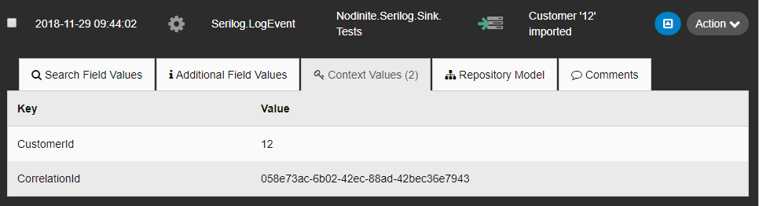

[](https://nodinite.com)

# Nodinite.Serilog.Sink.Core

[](https://ci.appveyor.com/project/syron/nodinite-serilog-sink-core)
[](https://www.nuget.org/packages/Nodinite.Serilog.Sink.Core)

A [Serilog](https://www.nuget.org/packages/Serilog/2.7.2-dev-01033) sink that writes log events to [**Nodinite**](https://nodinite.com). This project is built with .NET Core 2.0.


The current version supports logging [**Nodinite**](https://nodinite.com) Log Events using

* [Log API](https://documentation.nodinite.com/Documentation/CoreServices?doc=/Log%20API/Overview)

Upcoming versions support logging [**Nodinite**](https://nodinite.com) Log Events using

* MSMQ 
* Azure Service Bus
* RabbitMQ
* ActiveMQ

Events that are logged to one of the messaging systems above can then be picked up and logged to [**Nodinite**](https://nodinite.com) using our [Pickup Events Service](https://documentation.nodinite.com/Documentation/LoggingAndMonitoring/Pickup%20LogEvents%20Service?doc=/Overview).

## Get Started

### Install Nodinite.Serilog.Sink.Core Nuget Package

Start by installing the NuGet package [Nodinite.Serilog.Sink.Core](https://www.nuget.org/packages/Nodinite.Serilog.Sink.Core/).

```
Install-Package Nodinite.Serilog.Sink.Core
```

### Configuration

[**Nodinite**](https://nodinite.com) requires some settings to be configured in order for events to be logged. Below you can see all settings that need to be configured.

|Field|Example Value|Comment|
|---|---|---| 
|LogAgentValueId|503|Who ([Log Agents](https://documentation.nodinite.com/Documentation/WebClient?doc=/5.%20Administration/1.%20Log/4.%20Log%20Agents/Log%20Agents)) sent the data|
|EndPointName|"Nodinite.Serilog.Sink.Tests"|Name of [Endpoint](https://documentation.nodinite.com/Documentation/RepositoryModel?doc=/Endpoints/Overview) transport|
|EndPointUri|"Nodinite.Serilog.Sink.Tests.Serilog"|URI for [Endpoint](https://documentation.nodinite.com/Documentation/RepositoryModel?doc=/Endpoints/Overview) transport |
|[EndPointDirection](https://documentation.nodinite.com/Documentation/CoreServices?doc=/Log%20API/Getting%20started/Log%20Event/Endpoint%20Directions)|0|Direction for [Endpoint](https://documentation.nodinite.com/Documentation/RepositoryModel?doc=/Endpoints/Overview) transport|
|[EndPointTypeId](https://documentation.nodinite.com/Documentation/CoreServices?doc=/Log%20API/Getting%20started/Log%20Event/Endpoint%20Types)|0|Type of [Endpoint](https://documentation.nodinite.com/Documentation/RepositoryModel?doc=/Endpoints/Overview) transport|
|OriginalMessageTypeName|"Serilog.LogEvent"|[Message Type Name](https://documentation.nodinite.com/Documentation/RepositoryModel?doc=/Message%20Types/Overview)|
|ProcessingUser|"Nodinite"|Log Identity|
|ProcessName|"My customer import process"|Name of process|
|ProcessingMachineName|"localhost"|Name of server where log event originated|
|ProcessingModuleName|"INT101-HelloHappyCustomers-Application"|Name of module|
|ProcessingModuleType|"FileImport"|Type of module, exe, dll, service|

#### Using code

Besides [Serilog](https://www.nuget.org/packages/serilog/), the following nuget packages need to be installed

* [Nodinite.Serilog.Sink.Core](https://www.nuget.org/packages/Nodinite.Serilog.Sink.Core)

Using the following code below you can start logging events to [**Nodinite**](https://nodinite.com).

```csharp
var nodiniteApiUrl = "{Your Nodinite Log API Url";
var settings = new NodiniteLogEventSettings()
{
    LogAgentValueId = 503,
    EndPointDirection = 0,
    EndPointTypeId = 0,
    EndPointUri = "Nodinite.Serilog.Sink.Tests.Serilog",
    EndPointName = "Nodinite.Serilog.Sink.Tests",
    OriginalMessageTypeName = "Serilog.LogEvent",
    ProcessingUser = "NODINITE",
    ProcessName = "Nodinite.Serilog.Sink.Tests",
    ProcessingMachineName = "NODINITE-DEV",
    ProcessingModuleName = "DOTNETCORE.TESTS",
    ProcessingModuleType = "DOTNETCORE.TESTPROJECT"
};

Logger log = new LoggerConfiguration()
    .WriteTo.NodiniteApiSink(nodiniteApiUrl, settings)
    .CreateLogger();
```

#### Using Appsettings.json (Preferred)

Besides [Serilog](https://www.nuget.org/packages/serilog/), the following nuget packages need to be installed

* [Microsoft.Extensions.Configuration](https://www.nuget.org/packages/Microsoft.Extensions.Configuration/2.2.0-preview3-35497)
* [Microsoft.Extensions.Configuration.Json](https://www.nuget.org/packages/Microsoft.Extensions.Configuration.Json/2.2.0-preview3-35497)
* [Nodinite.Serilog.Sink.Core](https://www.nuget.org/packages/Nodinite.Serilog.Sink.Core)
* [Serilog.Settings.Configuration](https://www.nuget.org/packages/Serilog.Settings.Configuration/)

Using the following code to initialize the logger in your application:

```csharp
var configuration = new ConfigurationBuilder()
    .AddJsonFile("appsettings.json")
    .Build();

Logger log = new LoggerConfiguration()
    .ReadFrom.Configuration(configuration)
    .CreateLogger();
```

And putting the following into your appsettings.json:

```json
{
  "Serilog": {
    "Using": [ "Nodinite.Serilog.Sink.Core" ],
    "WriteTo": [
      {
        "Name": "NodiniteApiSink",
        "Args": {
          "NodiniteApiUrl": "",
          "Settings": {
            "LogAgentValueId": 503,
            "EndPointName": "Nodinite.Serilog.Sink.Tests",
            "EndPointUri": "Nodinite.Serilog.Sink.Tests.Serilog",
            "EndPointDirection": 0,
            "EndPointTypeId": 0,
            "OriginalMessageTypeName": "Serilog.LogEvent",
            "ProcessingUser": "NODINITE",
            "ProcessName": "Nodinite.Serilog.Sink.Tests",
            "ProcessingMachineName": "NODINITE-DEV",
            "ProcessingModuleName": "DOTNETCORE.TESTS",
            "ProcessingModuleType": "DOTNETCORE.TESTPROJECT"
          }
        }
      }
    ]
  }
}
```

### Logging Context Properties

```csharp
ILogger log = new LoggerConfiguration()
    .WriteTo.NodiniteApiSink(nodiniteApiUrl, settings)
    .CreateLogger()
    .ForContext("CorrelationId", Guid.NewGuid())
    .ForContext("CustomerId", 12);

log.Information("Customer '12' has been imported.");
```

The Serilog sink will automatically loop over all context properties you have defined in your code and log them as part of your event to [**Nodinite**](https://nodinite.com). 

Example:

